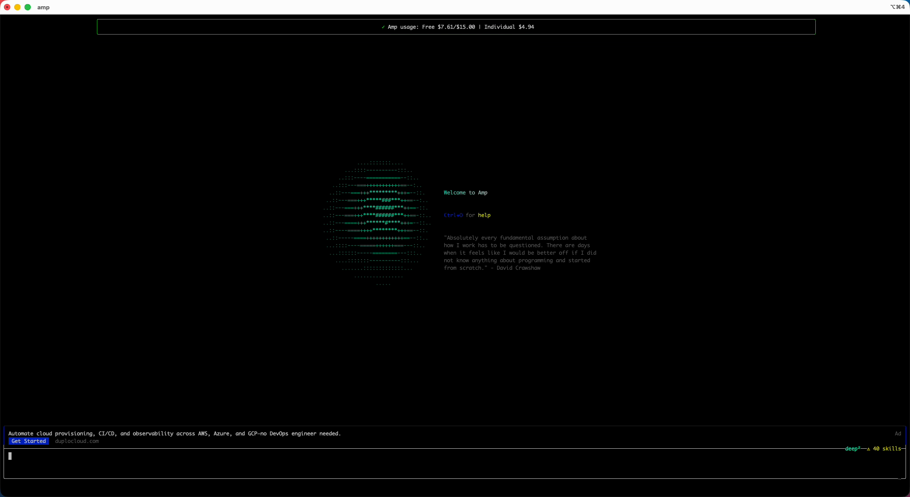
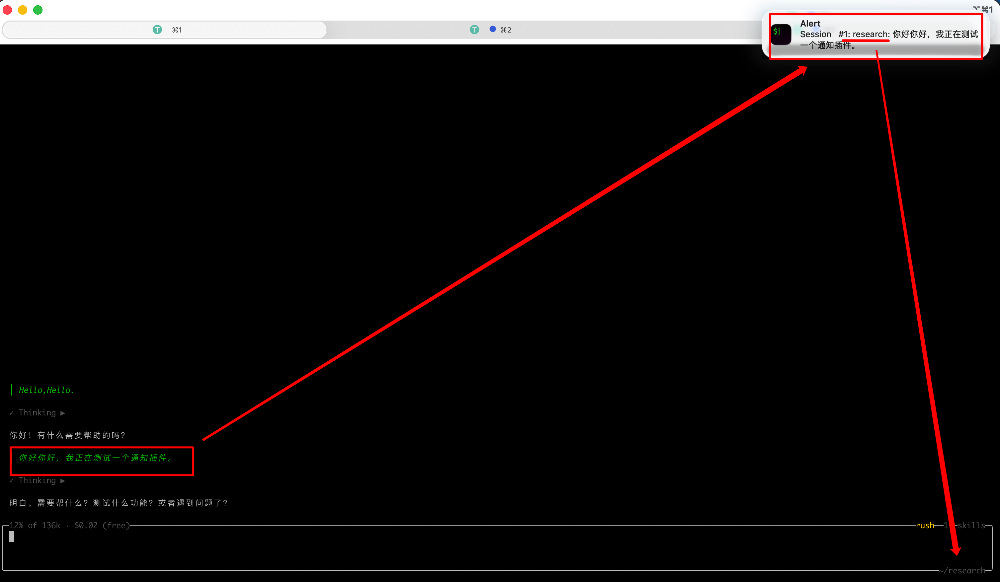

# Share Amp Plugins

Community-style repo for sharing practical Amp plugins.

Current plugins:

- `usage-monitor`: notifications for `amp usage` balance changes.

- `amp-notify`: native macOS/iTerm2 notifications when agent tasks complete (via iTerm2 + tmux), support jump back to your agent pane in tmux.
Plugin API docs: https://ampcode.com/manual/plugin-api

## Demo


### Usage Monitor Demo

[](assets/usage-monitor-demo.mp4)


### Amp Notify Demo

[](assets/amp-notify.mp4)


## Repo Structure

```text
share-amp-plugins/
└── plugins/
    ├── amp-notify/
    │   ├── README.md
    │   └── amp-notify.ts
    └── usage-monitor/
        ├── README.md
        └── usage-monitor.ts
```

## Quick Start

1. Copy plugin file to your Amp plugins directory:

   ```bash
   mkdir -p ~/.amp/plugins
   cp plugins/usage-monitor/usage-monitor.ts ~/.amp/plugins/
   ```

2. Start Amp with plugins enabled:

   ```bash
   PLUGINS=all amp
   ```

3. In Amp command palette, run:

   - `Usage Monitor: Show usage now`

## Notes

- Amp Plugin API is still evolving; compatibility may change.
- Keep plugin logic small, explicit, and easy to copy.
